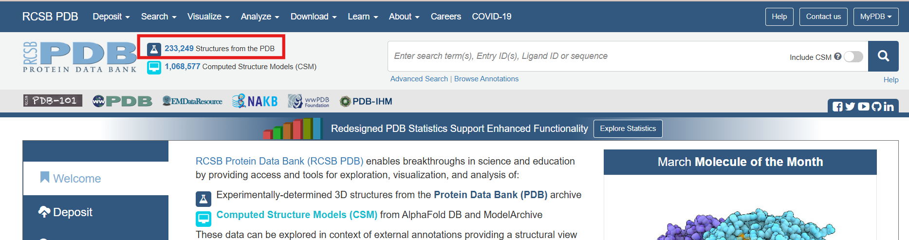
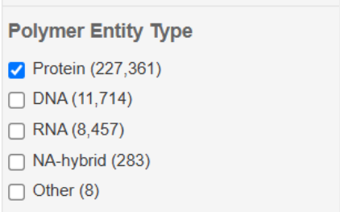

# 1. Identificación instancias ligando-proteína

El objetivo principal de esta primera etapa es identificar instancias de complejos ligando-proteína del Protein Data Bank (*PDB*).
Con estas se tiene que realizar una tabla que almacene toda la información relevante.

Primero se identifícan todos los **ID** de las entradas proteica del PDB.

Una vez identificado los identificadores ID, se puede empezar a realizar la tabla que tendrá que tener esta información:

- PDB EntryID,
- Classification,
- Organismo,
- Uniprot ids,
- Ligand Ids,
- Ligand InChI
- Expermental method,
- Resolución

En el archivo notebook "**Crear_Tabla_PDB.ipynb**" se explica como se obtuvo la tabla y como se armonizó la columna "*Classification*".

Sucesivamente se han descartado los ligandos unídos covalentemente. Se ha utilizado el script del sowftware **PDB-CAT**, desarrollado por el grupo de investigación 
*URV Cheminformatics*. Este script permite clasificar estructuras proteicas del Protein Data Bank (PDB) en tres categorías: 

• Apo: proteínas sin ligandos. 
    
• Unidas covalentemente: proteínas con ligandos unidos mediante enlaces covalentes. 
    
• Unidas no covalentemente: proteínas con ligandos unidos mediante interacciones no covalentes. 
    
El script generó un archivo en formato CSV que permitió identificar y eliminar las entradas con ligandos unidos covalentemente. Debido a que el script PDB-CAT trabaja directamente sobre archivos mmCIF (Macromolecular Crystallographic Information File), fue necesario descargar individualmente cada archivo mmCIF del PDB mediante un script que utiliza funciones de Biopython.

El trabajo con **PDB-CAT** se explica en el notebook "**Ligandos_covalentes.ipynb**". La búsqueda se ha realizado con los archivos divididos en varias carpetas debído al elevado número de archivos.

En el notebook "**Unir_resultados_PDBCAT.ipynb**" se explica como se han unído los diferentes archivos de output y como se han descartado las entradas con enlaces covalentes.

En el notebook "**Filtros_ligandos.ipynb**" se explica como se aplican los siguientes filtros al dataframe:

• Eliminar unos ligandos: MAN, GAL, BGC, BMA, NAG, A2G. (azucares simples)

• Descartar entrada sin Uniprot_id

• Descartar entrada sin código InChI/Ligando UNL

Los ligandos que no tienen código InChI corresponden a los llamados “UNL”, es decir, Unknown.

Sucesivamente se han detectado y descartado los oligosacaridos ramificados.
En el notebook "**oligosacaridos_ramificados.ipynb**" se explica como se detectaron y en "**oligosacaridos_ram_unir_descartar.ipynb**"se explica como se descartaron. Los análisis se realizaron por bloque de ligandos.

Luego, se descartarno las entradas grandes, con un tamaño > a 3 Mb. Eso se explica en el notebook "**Descartar_archivos_grandes.ipynb**".

Tras unir los archivos de output generados, se identificaron los ligandos unidos a más de una familia de proteínas.
Este análisis se explica en el notebook "**Grupos_ligandos_familias.ipynb**".

El dataframe final tiene:

- Ligandos distintos: **3,273**
- Número de entradas: **40,181**

